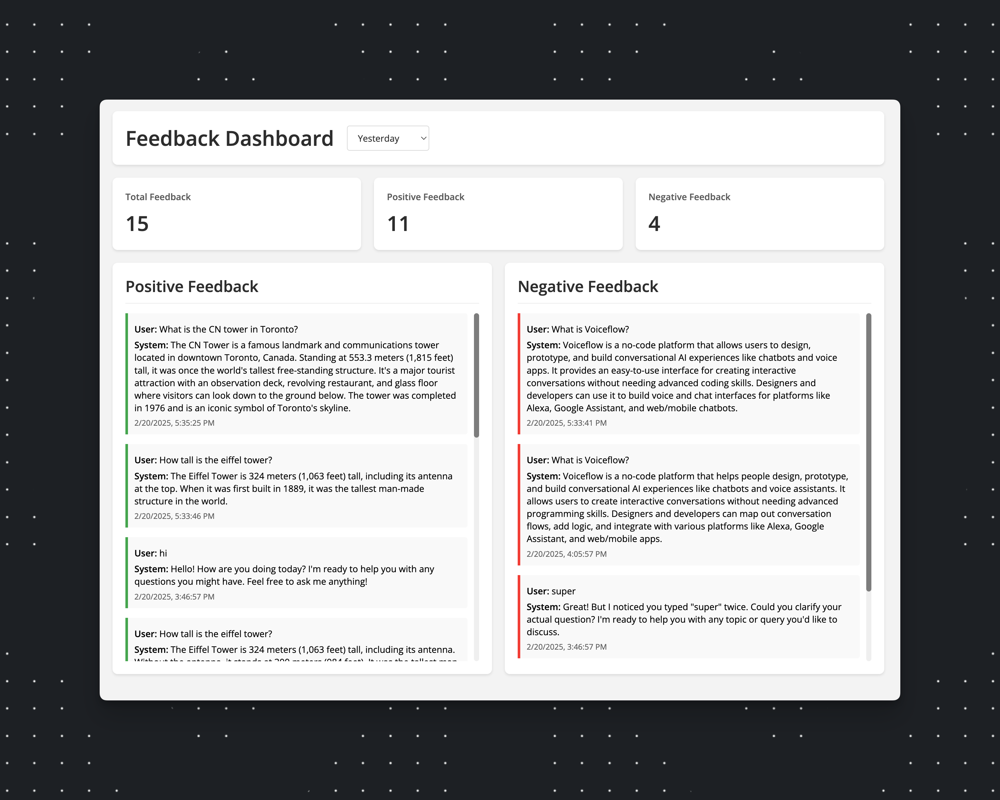

# Answers | User Feedback

A feedback collection and visualization system demo for Voiceflow conversations. This application allows you to gather, store, and display user feedback from your Voiceflow widget interactions, providing valuable insights into user satisfaction and conversation quality.



## Overview

This application provides:
- Real-time feedback collection from Voiceflow conversations
- Interactive dashboard for visualizing feedback data
- Filtering options by date ranges
- Separate views for positive and negative feedback
- Statistics overview

## Project Structure

```
.
├── src/
│   └── server.js          # Express server implementation
├── public/
│   ├── index.html        # Feedback collection interface
│   ├── dashboard.html    # Admin dashboard interface
│   └── favicon.ico       # Website favicon
├── extensions/
│   └── feedback.js       # Voiceflow Chat Widget extension for feedback collection
├── package.json          # Project dependencies and scripts
└── .env                  # Environment variables configuration
```

## Prerequisites

- Node.js (v14 or higher)
- npm (Node Package Manager)
- A Voiceflow API key

## Setup

1. Clone the repository:
```bash
git clone https://github.com/voiceflow-gallagan/answers-user-feedback.git
cd answers-user-feedback
```

2. Install dependencies:
```bash
npm install
```

3. Configure environment variables:
   - Copy `.env.example` to `.env`
   - Add your Voiceflow API key:
```bash
VF_API_KEY=your_api_key_here
```

4. Configure your project settings:
   - Open `public/index.html`
   - Update the following variables in the script section:
```javascript
const projectID = 'your_project_id_here'  // Your Voiceflow project ID
```

5. Start the server:

For production:
```bash
npm start
```

For development with auto-reload:
```bash
npm run dev
```

6. Access the application:
   - Chat Widget: `http://localhost:3000`
   - Dashboard: `http://localhost:3000/dashboard.html`

## Widget Extension

To collect feedback in your Voiceflow agent:

1. We use the feedbeck.js extension to collect feedback in the chat widget

2. In you Voiceflow agent:
   - Add a Custom Action step where you want to trigger the feedback extension
   - Set the Custom Action name to `ext_feedback`

## Demo Agent

A demo Voiceflow agent is included in the repository to help you get started:

1. Locate the `Users_Ranking_Demo-2025-02-21_11-08.vf` file in the root directory
2. Import this file into your Voiceflow workspace:
   - Go to your Voiceflow workspace
   - Click on "Import .vf file"
   - Select the .vf file


The feedback extension will:
- Display feedback options in the chat interface
- Collect user feedback (thumbs up/down)
- Use the server endpoint to store the feedback with the current conversation transcript using the Transcripts API

## Features

- **Real-time Feedback Collection**: Gather immediate feedback during conversations
- **Interactive Dashboard**
- **Statistics Overview**


## API Endpoints

- `POST /api/feedback`: Submit new feedback
- `GET /api/transcripts`: Retrieve conversation transcripts with feedback

## Video

[](https://www.youtube.com/watch?v=herpxOvDtzE)
